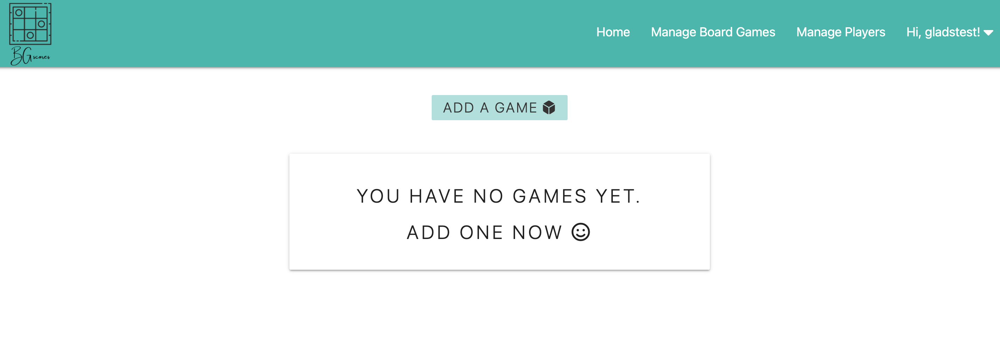

<h1 align="center">BG-scores</h1>

[View the live project here.](https://bg-scores.herokuapp.com/)

BG scores is a web application that allows user to record the boardgames that they played, including the date of the game, the players and their scores. The application allows for the user to manage the list of boardgames and players in their account.


<br/>
<br/>
<br/>

## User Experience (UX)

<hr>

### User stories

- As a potential user, I want to be able to register for an account.
- As a current user, I want to be able to log in and out of my account.
- As a user, I want to be able to record (create) the games that I played. The game information would include:
  - Boardgame
  - Date of when the game was played
  - The players and their scores
- As a user, I want to see all the games I played in the homepage (read).
- As a user, I want to be able to edit the game I played (update).
- As a user, I want to be able to delete a game I played (delete.
- As a user, I want to be able to manage the board games in my account, by being able to:
  - Create a boardgame
  - See a list of all the boardgames I created
  - Edit the name of a boardgame I created
- As a user, I want to be able to manage the players in my account, by being able to:
  - Create a player
  - See a list of all the players I created
  - Edit the name of a player I created

### Design

- #### Typography and Colour Scheme

  - In this project, [Materialize V1.0.0](https://materializecss.com/) was used to create a responsive front-end. The default typography was used, while [colour palette](https://materializecss.com/color.html) teal, with different shades, were used for the colour scheme.

- #### Logo
  - [Canva](https://www.canva.com/) was used to create a logo for bg-scores.
- #### Favicon
  - BG-scores favicon was used to allow the user to distinguish the tab when multiple tabs are open in their browser, which allows for a better user experience.

- #### Animations
  - logo-bounce-animation: When there is a hover on the logo, logo-bounce-animation is applied to let the user know that the logo is a clickable link. The logo-bounce-animation adds some fun to the website.

### Wireframes

- Wireframes for this project are available [here](wireframe/bg-score.png).

<br>
<br>

## Database architecture
<hr>

This project has four collections:

1. games

   - List of games played by each user, containing information about the game such as the name of the boardgame played, when the game is played, and a list of players and their scores.

     ```
     _id: ObjectId
     boardgame: id of the boardgame played, in string format
     game_date: date of the game, in ISO format
     created_by: user, stored in the session cookie storage, string format
     players_scores: [
       {
       player: id of the player, in string format,
       score: integer,
       isWinner: boolean,
       },
       {
       player: id of the player, in string format,
       score: integer,
       isWinner: boolean,
       },
     ]
     ```

     


2. boardgames
   
   ``` 
   _id: ObjectId, 
   boardgame: name of the boardgame as input by the user, in string,
   creaetd_by: user, stored in the session cookie storage, string format 
   ```

3. players
   ```
   _id: ObjectId, 
   player: name of the player as input by the user, in string, 
   creaetd_by: user, stored in the session cookie storage, string format 
   ```

4. users
   ```
   _id: ObjectId, 
   username: string, 
   passsword: string (hash) 
   ```

In this project, the boardgame and player name stored in the game collecttion is the corresponding id (in string format) from the ObjectId, rather than the name of the boardgame or player. This was implemented to ensure that if the player or boardgame name is edited, the correct name will be displayed to the user, as the id will always be the same. 

<br>
<br>

## Features

<hr>

### As a potential user, I want to be able to register for an account.

- Once the page is loaded, the function `get_games()` checks if session cookie storage has a value.
  - If there is sometthing stored in the session cookie, the homepage is loaded.
  - If the session cookie storage is empty, the login page is loaded.
- In the login page, a link that will re-direct the user to the register page is available below the login form.
- The register page asks for a username and a password.
- Once the user clicks submit, a check is performed to see if the username is already in the database. If it's already in the database, a flash message of "Username already exists, please try a new one." is shown. If the username is not in the database, we add it and a flash messae "Registration was succesful." is shown.

<br>

### As a current user, I want to be able to log in of my account.

- The login page asks for a username and password.
- Once submitted, we first perform a check of whether the username exists in the database. If it doesn't exist, a flash message of "Invalid username and/or password" is shown. If the username exists, a check of whether the corresponding password_hash present in the databse matches. If it doesn't match, the same flash message will be shown. We don't want the user to know if it's the username or password that is incorrect to prevent brute forcing into our forms. If the username and password matches, the user is redirected to get_games, which is the homepage and will display all the games previously played.

<br>

### As a user, I want to be able to log out of my account.

- In the header, the user is greated with Hi, `username`!. When hovered,the logout button will be available. Once the logout button is clicked, the data `user` stored in the session cookie will be removed and the user will be redirected to the login page.

<br>

### As a user, I want to be able to record the games that I played, by:

  i) Adding a board game from a list of pre-added board games <br>
  ii) Seeing a list of all my board games <br>
  iii) Editing a name of a board game <br>
  iv) Deleting a board game <br>

- In the homepage, a button labelled as "Add a Game" is available to allow the user to add their game details. Once the button is clicked, the user is navigated to `/add_game` page where a form is available.
- In this form, a the user can:
  - Select a previously added boardgame from the dropdown
  - Pick the date of the game
  - Select players using the dropdown checklist
  - Once the players are selected, an input field will be available beside the player's name wher the user can add their score
  - All these information are required. The user will not be able to submit the form if an information is missing. The line below the input will turn red to let the user know that the information is missing. 
  - Once submitted, the information in the form is inserted and stored in the games collection of the database, in a format discussed in the database architecture section above. Python functions were written to transform the data from what is given by the form inputs to the desired format.
  - Finally, the user is redirected to `/get_games` where the user can see all the games recorded.
  - In the games card, an edit and delete buttons are available.
  - If the edit button is clicked, a similar to add_game form is used for editing the game, with the inputs pre-filled with the information previously filled.
  - The add_game and edit_game forms have a "back to games" button on the top left corner to allow the user to go back in case the change their minds and does not want to add or edit the game. This allows for a better user experience.
  - If the delete button is clicked, the user is asked if they are sure that they want to delete the game. The user can either pick "yes, delete the game", which will delete the game, or "no, don't delete the game", which will bring the user back to the game page without deleting the game.

<br>

### As a user, I want to be able to manage the boardgames in my account, by:

i) Adding a board game <br>
ii) Seeing a list of all my board games <br>
iii) Editing a name of a board game <br>
explain why there's no delete <br>

### As a user, I want to be able to manage the players in my account, by:

i) Adding a player <br>
ii) Seeing a list of all the players <br>
iii) Editing a player's name <br>

<br>

- Adding a new boardgame and player has the same functionality as adding a game. Once submitted, a list of the previously added boardgames or players will be available in the `/get_boardgames` or `/get_players` page, and these boardgames and players will be available in the add / edit games form.
- It has been decided that in this application, the user cannot delete the boardgame or player, and only able to delete it. This is to avoid having an error on the game collection if a boardgame or player is missing in the collection. 
- Instead, the user can edit the boardgame or player. The boardgame and player name stored in the game collecttion is the corresponding id (in string format) from the ObjectId, rather than the name of the boardgame or player. This was implemented to ensure that if the player or boardgame name is edited, the correct name will be displayed to the user, as the id will always be the same. 

### Accessibility

Ensure accessibility throughout the website by:

- Adding 'alt' text on all images.
- Font awesome icons are in an `<i>` tag. A span with a class "sr-only" is added which describes the icons. The "sr-only" class has a display:none in the stylesheet, which hides the text on screen, but allows for screenreader to be read.

<br/>

## Technologies Used

<hr>

The following technologies have been used in this project:

- [Python 3.8.2](https://www.python.org/download/releases/3.0/)
  - Python was used to implement a back-end, by creating the CRUD functionality.
- [Flask](https://flask.palletsprojects.com/en/1.1.x/)
  - Web framework written in Python to allow build web applications.
- [Jinja](https://jinja.palletsprojects.com/en/2.11.x/)
  - A templating engine language for Python and dependent on the Flask framework.
- [MongoDB](https://www.mongodb.com/)
  - A document-oriented database program, where the data is stored.
- [Heroku](https://heroku.com/)
  - Used to deploy the project.
- [HTML](https://www.w3.org/TR/html52/)
  - Used to structure and presenting the web content.
- [CSS](https://www.w3.org/Style/CSS/Overview.en.html)
  - Used for styling the web content.
- [JavaScript](https://en.wikipedia.org/wiki/JavaScript)
  - Used to make the website interactive.
- [JQuery](https://jquery.com/)
  - JavaScript library used to ensure interactivity, especially on Materialize components to work as intended.
- [Materialize 1.0.0](https://materializecss.com/)
  - CSS framework used for this project for structuring and presenting the content.
- [FontAwesome](https://fontawesome.com/)
  - Font Awesome was used throughout the website to add icons for better aesthetic and UX purposes. <br/><br/>

## Testing

<hr>


The W3C Markup Validator and W3C CSS Validator Services were used to validate every page of the project to ensure there were no syntax errors in the project.

- [W3C Markup Validator](https://validator.w3.org/#validate_by_uri) <br>

The warning below appeared:
```
Warning: Section lacks heading. Consider using h2-h6 elements to add identifying headings to all sections.

From line 48, column 5; to line 48, column 13

der>↩↩    <section>↩     
```
To solve, `<h2>` heading were added on `<section>` tags, with a class name of `sr-only` so it does not appear on the page and not change the current UI, but avoid the warning. 

- [W3C CSS Validator](https://jigsaw.w3.org/css-validator/#validate_by_input)

- remove white outline on header

- ensure that only the details loaded by the user is rendered:
  - session user added
  - put condition
  - test if that works

- isWinner is incorrect
  - root cause - scores being stored as string
  - convert to string by:
    ```python
    scores = request.form.getlist("score")
    scores_int = [int(score) for score in scores]
    ```
- edit game, URL has game_id. If this game_id is incorrect (random digits put by user), a 500 error is given and page doesn't handle it.
  - Write a function that will handle 500 error
  - Render html template
  - Along with this, write a handler for 404 too

### Manual testing were also performed to ensure that the application works as intended. During this, the following errors were found and were rectified:

1. If the user has a url of edit or delete game, edit boardgame, or edit player (for example, edit game: http://0.0.0.0:5000/edit_game/60bfd8c0e67d2a5f4ac05115), even if the user is logged out, theu can access the edit or delete game, edit boardgame, or edit player. This is a risk because:

   - Unauthorized user, a user that does not have an account, can manipulate the items.
   - As a precaution, edit or delete game, edit boardgame, or edit player are only displayed if a user is logged in by checking the session cookie storage. Otherwise, the user will be navigated to the login page. This code was added for this purpose:

   ```python
   # Check if there is a user data saved in the cookie session storage
   # If not, redirect to login page
   if not session.get("user"):
       return redirect(url_for("login"))
   ```

    <br>

2. Another potential issue was a user can access another users' data if they have a link that contains the id of the item. To avoid this:

   - In the edit game, delete game, edit boardgame, or edit player, an additional if statement was added to check if the user stored in the session cookie storage is the same user that created the item. If not, the `no_access.html` is rendered.
  

   Checks / tests on each below were performed by getting the data from one user, saving the link, logging out, logging in to a different user, then copy pasting the link saved from the previous user, to check if the `no_access.html` would work. 
   
   <br>
   Local version: <br>
   - edit game: working <br>
   - delete game: working <br>
   - edit boardgame: working <br>
   - edit player: working 
   - <br>
     <br>
    Deployed: <br>
   - edit game: working <br>
   - delete game: working <br>
   - edit boardgame: working <br>
   - edit player: working <br>
<br>
  

3. Mostv `<i>` tags used for font awesome icons did not have a span with a class "sr-only" is added which describes the icons, where the "sr-only" class has a display:none in the stylesheet, which hides the text on screen, but allows for screenreader to be read. This was rectified.
   
<br>

4. For a new user, there will initially be no game, boardgame or player present. The page was empty, which does not give a great user experience. Therefore, a card component was created to indicate that there is no game, boardgame or player for better user experience.
     
     
     

5. While step 4 was being tested, it was noticed that despite adding a boardgame and player, the `/get_boardgames` and `/get_players` page was not rendering the recently added players. It was found that an error in python code exists, where for games collection was being searched instead of the boardgames and players collection. This was rectified and tested, and was able to display the recently added boardgame and player.

6. Error on the console about missing favicon. Favicon was added based on the information from this [link](https://flask.palletsprojects.com/en/2.0.x/patterns/favicon/).

   
## Deployment

<hr>

<br>
<br>
<br>

## Credits

<hr>
- Hide Arrows From Input Number 
https://www.w3schools.com/howto/howto_css_hide_arrow_number.asp

- Adding Favicon
  https://flask.palletsprojects.com/en/2.0.x/patterns/favicon/

### Code

### Content

- All content was written by the developer.

### Media

### Acknowledgements

- My mentor, Narender Singh, for continuous helpful feedback.
